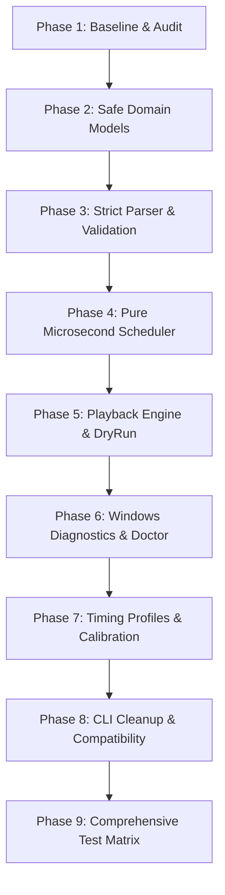
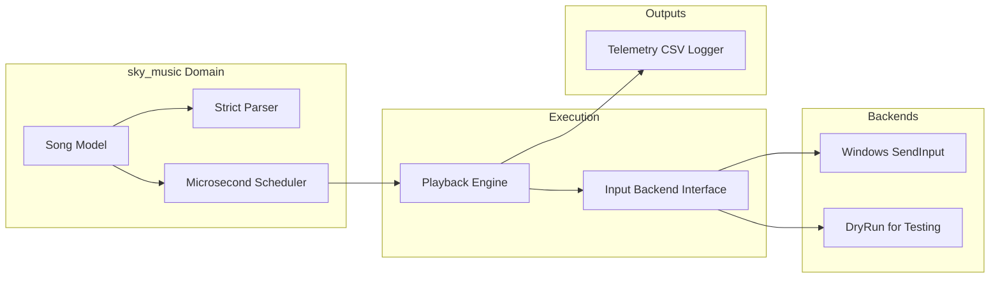

# Precision Playback Engine Upgrade Plan: Detailed Specification

This document details the step-by-step technical plan to upgrade the Sky music playback helper to a precision, microsecond-accurate engine.



---

## 0. Technical Architecture Refactoring

Currently, `main.py` is bloated and does both timing, OS input dispatch, UI, CLI configuration, and error logging. The upgraded design separates these concerns cleanly:



---

## 1. Upgrade Phases Specification

### Phase 1: Baseline Audit & Integration Tests
*   **Goal**: Establish a baseline verification suite so we can mathematically guarantee that new code does not degrade timing or drop features.
*   **Deliverables**:
    *   `docs/timing-baseline.md`: Describes the legacy behavior (such as `KEY_HOLD_SECONDS` = 20ms, same-key repeat handling, float time constraints).
    *   `tests/test_scheduler_current_behavior.py`: Tests the old scheduler via unit tests, validating:
        *   Chord coalescing.
        *   Single notes creating down/up actions.
        *   Same-key repeat hold compression logic.
*   **Pass Criteria**: All unit tests pass using `pytest`. No runtime production code changed.

---

### Phase 2: Domain Models & Layout Isolation
*   **Goal**: Clean up data pollution from JSON dicts and decouple layouts from user32 primitives.
*   **Deliverables**:
    *   `sky_music/domain.py`: Typed immutable slot-dataclasses:
        *   `NoteKey = str`
        *   `Note(time_ms: int, key: NoteKey)`
        *   `Chord(time_ms: int, keys: tuple[NoteKey, ...])`
        *   `Song(name: str, chords: tuple[Chord, ...])`
        *   `InstrumentProfile(name: str, note_count: int, key_map: dict[NoteKey, str])`
    *   `sky_music/layouts.py`: Contains keymaps (e.g. 15-key maps mapping `Key0` through `Key14` to standard QWERTY scan codes).
*   **Transition Strategy**: Create adapters inside `songs.py` and `scheduler.py` so that old code can swallow these domain models without changing execution flow.
*   **Pass Criteria**: Legacy tests and new domain-layout unit tests pass.

---

### Phase 3: Strict Parser & Validation
*   **Goal**: Prevent silent note skips. Stop playing if file formatting or mappings are corrupt, indicating the exact file and note index.
*   **Deliverables**:
    *   `sky_music/parser.py`: Implements `parse_song_file(path, profile) -> Song`.
    *   `sky_music/validation.py`: Strict validation logic.
        *   Validates list of notes, chronological sorting, and rejects negative durations/timestamps.
        *   Raises `SongValidationError` or `SongParseError` with contextual details.
*   **Pass Criteria**:
    *   Invalid files fail immediately with clean CLI errors.
    *   Legitimate songs load perfectly.
    *   No more print statement skips inside parsing code.

---

### Phase 4: Pure Microsecond Scheduler
*   **Goal**: Build a scheduler using pure integer microseconds to eliminate float accumulation drift. Prioritize note onsets (down-events) under all conditions.
*   **Deliverables**:
    *   `sky_music/scheduler.py` (New):
        *   `KeyAction(at_us: int, scan_codes: tuple[int, ...], kind: Literal["down", "up"], reason: str)`
        *   `TimingPolicy` dataclass with microsecond configurations (`hold_us`, `min_hold_us`, `release_gap_us`, etc.).
        *   `build_key_actions(song, profile, timing_policy) -> tuple[KeyAction, ...]`
    *   **Core Logic Upgrade**:
        *   If note sequence schedules a same-key repeat, release the key early enough (`repeat_release_gap_us`) so the next key-down onset is fired exactly on time.
        *   Key-ups for other independent keys must **never** preempt or delay a pending key-down. If a key-up is due at the same time or slightly later than a key-down, it is deferred/coalesced *after* the key-down batch has been submitted to Windows.
*   **Pass Criteria**: Pure scheduler tests run with zero reliance on ctypes/Windows, asserting timing priorities perfectly.

---

### Phase 5: Playback Engine, Dry-Run & Telemetry
*   **Goal**: Decouple input actions from Windows so playback can be fully dry-run tested on any platform. Record precision delays.
*   **Deliverables**:
    *   `sky_music/backend.py`: `InputBackend(Protocol)` specifying `key_down(scan_codes)`, `key_up(scan_codes)`, and `release_all()`.
    *   `WinSendInputBackend`: Implements `InputBackend` using `SendInput`.
    *   `DryRunBackend`: Implements `InputBackend` but only writes event history to a list.
    *   `sky_music/playback.py`: `PlaybackEngine` that consumes scheduled `KeyAction` items, tracks time using `time.perf_counter()`, handles pause, resume, focus tracking, and dispatches actions to backends.
    *   `sky_music/telemetry.py`: CSV Telemetry logger that records:
        ```csv
        song,event_index,kind,scheduled_us,actual_us,lateness_us,scan_codes,reason
        ```
*   **Pass Criteria**: DryRun tests run successfully on mock timing timelines. Telemetry produces accurate CSV files under `--debug-csv`.

---

### Phase 6: Windows Diagnostics & Hardening
*   **Goal**: Help users solve administrative mismatches and layout incompatibilities without breaching game processes.
*   **Deliverables**:
    *   `sky_music/doctor.py`: Diagnostics tool.
        *   Preflight checks: warns if target key combinations are physically held down before playing.
        *   Admins / Integrity levels: warns about running as non-Admin if target process is elevated.
        *   Verifies timer resolution settings via `winmm`.
*   **Pass Criteria**: Running `python main.py --doctor` outputs detailed diagnostic profiles.

---

### Phase 7: Calibration & Profiles
*   **Goal**: Allow flexible performance tuning.
*   **Deliverables**:
    *   Four predefined timing profiles:
        *   `local-precise`: low-latency local playback.
        *   `balanced`: default general-purpose timing.
        *   `remote-safe`: longer holds and gaps for remote/listener clarity.
        *   `dense-safe`: safer handling for dense chords and repeats.
    *   CLI options: `--timing-profile`, `--hold-ms`, `--min-hold-ms`, `--release-gap-ms`, `--fps`, `--debug-csv`.
    *   `docs/timing-calibration.md`: Instruction guide detailing how to read CSV log drift and select optimal timing profiles for custom rigs.
*   **Pass Criteria**: Overrides parse correctly and customize scheduled `KeyAction` bounds.

---

### Phase 8: CLI Cleanup & Compatibility Layer
*   **Goal**: Clean up main entrypoint while making sure legacy flags continue to work seamlessly.
*   **Deliverables**:
    *   Streamlined `main.py` doing strictly CLI argument parsing and high-level runner logic.
    *   Adapters for legacy custom hotkeys, repeats, countdowns, and themes.
    *   Updated `README.md` containing performance troubleshooting & calibration tutorials.
*   **Pass Criteria**: Retroactive tests for arguments pass. The old CLI syntax plays songs without any user-facing friction.

---

## 2. Risk Mitigation & Verification Matrix

| Risk | Mitigation Strategy | Verification Phase |
| :--- | :--- | :--- |
| **Silent song parsing skips** | Replace all print warnings inside parser with strict `SongValidationError`. | Phase 3 |
| **Float accumulative drift** | Enforce standard integer calculations inside `scheduler.py` via microseconds. | Phase 4 |
| **Blocked Onsets due to KeyUp delays** | Never sleep synchronously during key-up. Queue key-ups into the timeline; let the main loop tick and fire key-downs exactly on time. | Phase 4 & Phase 5 |
| **Platform dependency in tests** | Decouple OS injection using `InputBackend` protocol. Run unit tests using `DryRunBackend` on any OS. | Phase 5 |
| **UIPI Blocking** | Capture OS level error codes from `SendInput` and prompt actionable guidance. | Phase 6 |
